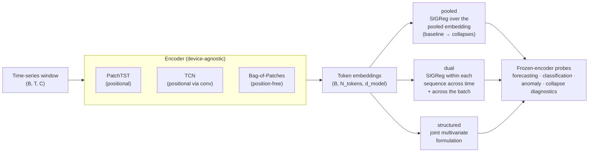
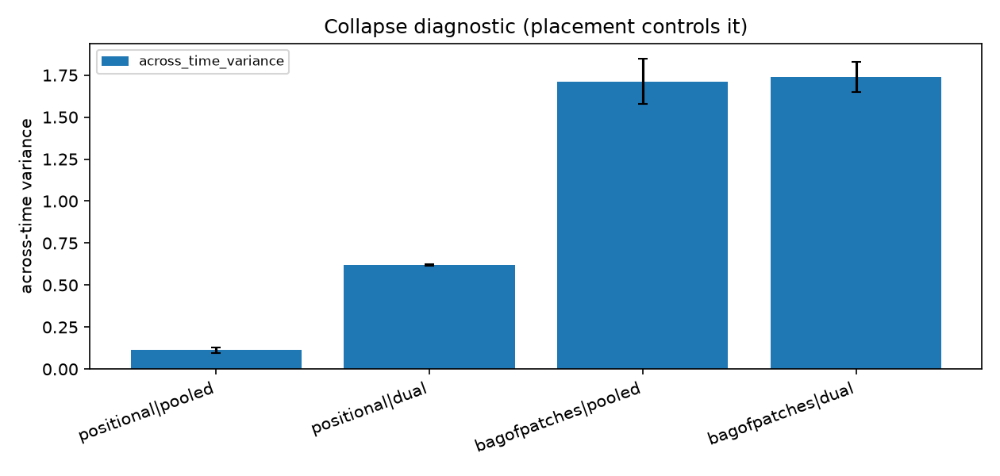
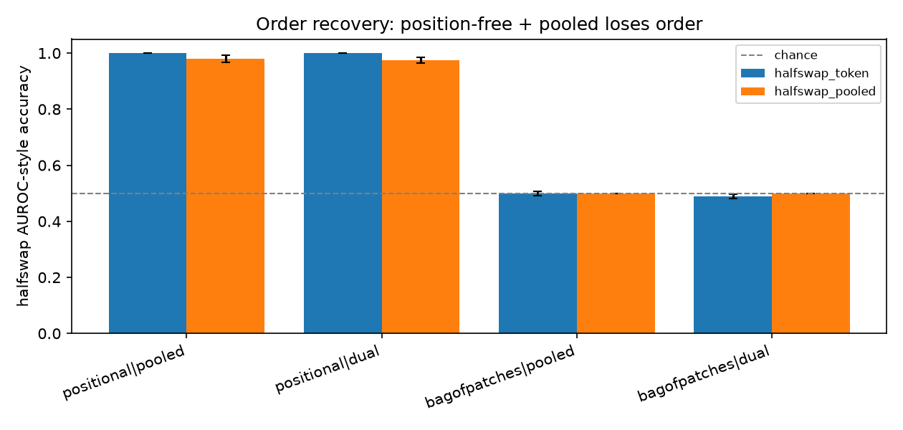
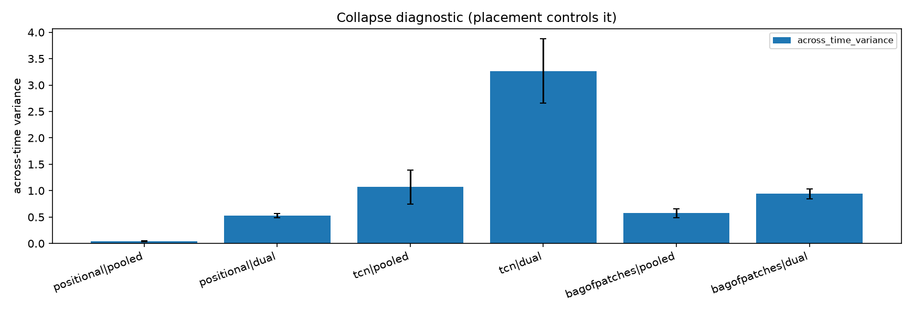
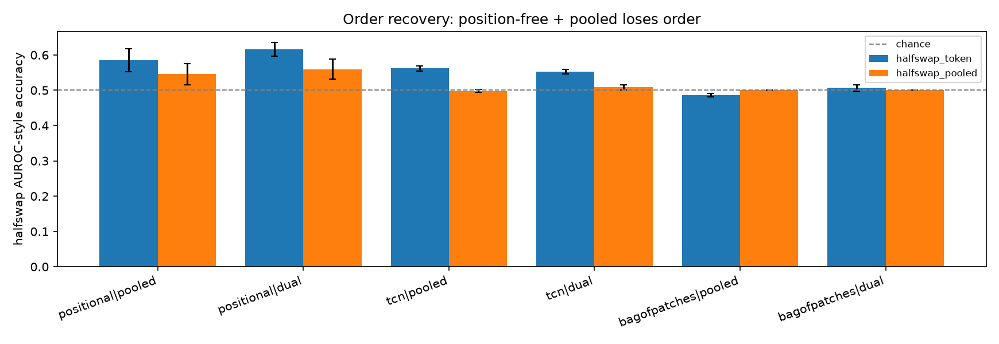
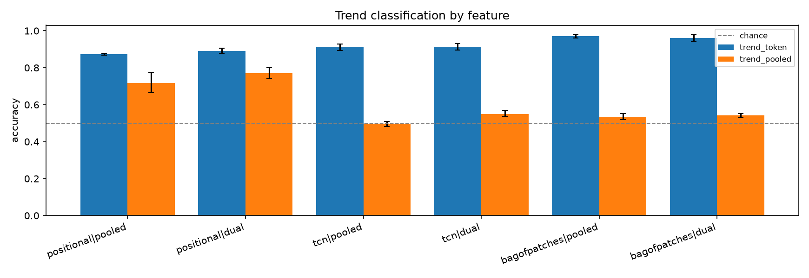
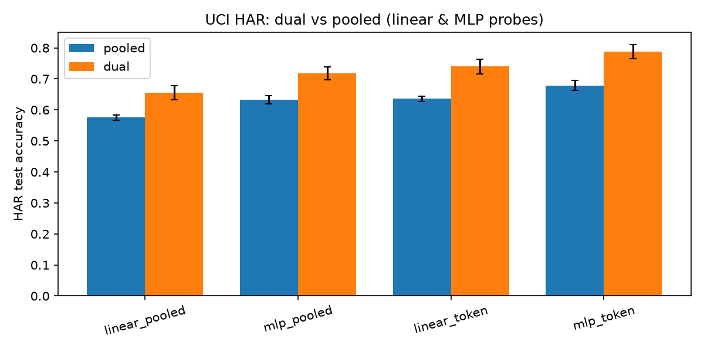

<div align="center">

# ChronoJEPA

### When Does the Time-Axis Collapse Matter?
**Disentangling Collapse, Positional Structure, and Representation Richness in SIGReg-Regularised Time-Series Representations**

Rishabh Patil · University of St Andrews

[](https://github.com/MrRobotop/ChronoJEPA/actions/workflows/ci.yml)
[](https://www.python.org/)
[](https://pytorch.org/)
[](tests/)
[](https://github.com/astral-sh/ruff)
[](https://github.com/astral-sh/uv)
[](LICENSE)
[](https://arxiv.org/abs/2511.08544)
[](#installation)
[](https://zenodo.org/records/20749452)

📄 **Read the paper:** [zenodo.org/records/20749452](https://zenodo.org/records/20749452)

</div>

---

> **TL;DR.** SIGReg (from [LeJEPA](https://arxiv.org/abs/2511.08544)) regularises embeddings toward an
> isotropic Gaussian with no stop-gradient, no teacher, and no schedulers. Applied naively to pooled
> sequence embeddings it causes a *time-axis collapse* ([LeJEPA issue #27](https://github.com/rbalestr-lab/lejepa/issues/27)).
> We confirm the collapse is real and that a `dual` placement robustly fixes it, then show the
> surprising part: **the across-time variance "collapse" diagnostic does not measure what we assumed.**
> It does not track downstream order availability and is anticorrelated with it. What actually governs
> order is the encoder's **positional structure**, an axis orthogonal to the placement that controls the
> collapse. Preventing the collapse instead buys **representation richness**, which helps real tasks
> (e.g. **+8 to +11 accuracy points on UCI HAR**) when their targets are structured rather than near-constant.

## Table of contents

- [Thesis](#thesis)
- [Research questions](#research-questions)
- [Method and architecture](#method-and-architecture)
- [Abstract](#abstract)
- [Key findings](#key-findings)
- [Experimental setup](#experimental-setup)
- [Installation](#installation)
- [Reproducibility guide](#reproducibility-guide)
- [Project layout](#project-layout)
- [Testing and continuous integration](#testing-and-continuous-integration)
- [Citation](#citation)
- [License](#license)

## Thesis

The project began with the assumption that the time-axis collapse is the thing to prevent, and that the
`dual` placement which prevents it should therefore yield better representations. A factorial study
overturned that assumption and produced a **two-axis account** that the rest of the repository defends:

1. **Order availability is set by architecture, not by the collapse.** Whether a representation retains
   temporal order is governed by the encoder's positional structure (positional encoding + attention, or
   convolution), not by how much the embeddings vary across time. A position-free encoder yields a
   permutation-invariant pooled feature scoring *exactly* `0.500` on a content-matched order probe on two
   datasets, while a positional transformer recovers order at `0.97`–`1.00` even when maximally collapsed.
2. **Preventing the collapse buys representation richness, not order.** The `dual` placement robustly
   prevents the collapse and raises effective rank. Whether that richness helps is task and dataset
   dependent, established with paired significance tests.

The across-time variance "collapse" diagnostic is therefore *anticorrelated* with order recovery in our
factorial: the most collapsed configuration keeps order, the least collapsed loses it.

## Research questions

| # | Question | Verdict |
|---|----------|---------|
| **RQ1** | Is the time-axis collapse real, and does the `dual` placement prevent it? | **Yes.** `dual` keeps ~9.5× the across-time variance of `pooled` on PEMS08 (0.607 vs 0.064), higher effective rank (11.5 vs 8.1), non-overlapping seed bands. |
| **RQ2** | Does preventing the collapse improve downstream forecasting? | **Dataset dependent.** Significantly better on ETTh2/ETTm1, significantly worse on PEMS08, null on ETTh1 (8 seeds, paired t-test + bootstrap CI). |
| **RQ3** | Does across-time variance measure downstream order availability? | **No — it is anticorrelated.** Order is governed by positional encoding, an axis orthogonal to placement. Confirmed across 3 architectures, 2 datasets, with an exact `0.500` chance anchor. |
| **RQ4** | Can SIGReg loss serve as a label-free model selector for time series? | **Not confirmed.** SIGReg loss does not track forecasting quality here; the only positive cross-config correlation is a placement-scale confound. |
| **RQ5** | Is there a real task where preventing the collapse clearly helps? | **Yes — UCI HAR.** `dual` beats `pooled` by 8–11 accuracy points under both linear and nonlinear probes, with non-overlapping bands, and the gain tracks collapse severity across architectures. |

## Method and architecture

SIGReg lifts a univariate normality test to many dimensions by projecting embeddings onto random unit
directions and averaging a per-direction statistic, regularising the batch toward an isotropic Gaussian.
ChronoJEPA studies **where** that objective is applied relative to the time axis.



- **`pooled`** — one SIGReg over the pooled sequence embedding. The baseline; expected to collapse.
- **`dual`** — SIGReg applied within each sequence across time *plus* across samples in the batch. The
  per-timestep embeddings of a single window are themselves pushed toward isotropy and cannot all coincide.
- **`structured`** — a joint multivariate variant (open research direction).

The SIGReg core (`chronojepa/sigreg/`) depends only on `torch` so it stays portable into other codebases,
and every statistical test is ground-truthed against scipy or a closed-form value in `tests/`.

## Abstract

LeJEPA (arXiv:2511.08544) replaces the heuristic machinery of self-supervised learning with a single
isotropic-Gaussian regulariser, SIGReg, applied with no stop-gradient, no teacher, and no schedulers.
Carrying SIGReg to sequence models raises a documented hazard (LeJEPA issue #27): a naive pooled
application can drive each sequence to a constant vector along time, a time-axis collapse that the
objective does not penalise. We build a self-supervised time-series library around this question and
compare three placements of SIGReg relative to the time axis: pooled (the baseline), dual (SIGReg within
each sequence across time plus across the batch), and structured (a joint variant). We confirm that the
collapse is real and that the placement controls it: dual robustly raises across-time variance by roughly
an order of magnitude relative to pooled.

Our central finding is negative and, we argue, clarifying. Through a factorial study that crosses encoder
architecture with placement and probe feature, we show that the across-time variance collapse does not
measure downstream order availability, and in our experiments it is anticorrelated with it. The
determinant of whether a representation retains temporal order is the encoder's positional structure
(positional encoding and attention, or convolution), an axis orthogonal to the placement that controls the
collapse. A position-free encoder yields a permutation-invariant pooled feature whose order-recovery
accuracy is exactly 0.500 on a content-matched probe on two datasets, while a positional transformer, even
when maximally collapsed, recovers order at 0.97 to 1.00. The result holds across three architectures
(positional transformer, temporal convolution, position-free bag of patches) and two datasets.

The dual placement is nonetheless useful where the task needs the richer representation it produces. On a
real labeled task, UCI HAR activity recognition, dual outperforms pooled by 8 to 11 accuracy points under
both linear and nonlinear probes. On forecasting, with eight seeds and paired significance tests, dual is
significantly better on ETTh2 and ETTm1, significantly worse on PEMS, and not different on ETTh1. We
therefore propose a two-axis account: preventing the time-axis collapse does not change order availability
(set by positional structure) but increases representation richness (higher effective rank), which helps
downstream tasks whose targets are structured rather than near-constant.

## Key findings

### 1. The collapse is real, and across-time variance is anticorrelated with order recovery

The factorial crosses encoder architecture (positional PatchTST vs a position-free bag-of-patches) with
placement on PEMS08, three seeds. The most collapsed configuration recovers a content-matched half-swap at
`0.98`; the least collapsed one is at chance `0.50`.

<div align="center">


</div>

| arch · placement | across-time var | eff rank | halfswap (token) | halfswap (pooled) |
|------------------|-----------------|----------|------------------|-------------------|
| positional · pooled   | 0.113 ± 0.018 | 6.62 ± 0.14 | 1.000 ± 0.000 | 0.980 ± 0.012 |
| positional · dual     | 0.620 ± 0.006 | 8.49 ± 0.19 | 1.000 ± 0.001 | 0.976 ± 0.010 |
| bagofpatches · pooled | 1.712 ± 0.135 | 1.45 ± 0.05 | 0.499 ± 0.008 | **0.500 ± 0.000** |
| bagofpatches · dual   | 1.739 ± 0.091 | 1.61 ± 0.05 | 0.489 ± 0.007 | **0.500 ± 0.000** |

The position-free pooled feature hitting *exactly* `0.500` is the architecture-independent anchor: a
genuinely position-free representation is exactly order-blind, regardless of placement.

### 2. The result replicates on a second, very different dataset (ETT)

The same factorial on ETTh1 (electricity transformer temperature, 7 channels, hourly) reproduces the
thesis through the clean order probe (trend from the pooled feature) and the exact `0.500` half-swap anchor.

<div align="center">



</div>

### 3. The one clear win for `dual`: UCI HAR activity recognition

On a real labeled, order-dependent task (9 inertial channels, 6 activities), self-supervised pretraining
then frozen-feature probing. `dual` beats `pooled` by 8–11 accuracy points on every probe, non-overlapping
bands, under both linear and nonlinear readouts.

<div align="center">

</div>

| placement | linear (pooled) | MLP (pooled) | linear (token) | MLP (token) | across-time var |
|-----------|-----------------|--------------|----------------|-------------|-----------------|
| pooled | 0.576 ± 0.008 | 0.633 ± 0.014 | 0.636 ± 0.009 | 0.679 ± 0.016 | 0.019 ± 0.003 |
| dual   | **0.655 ± 0.023** | **0.718 ± 0.021** | **0.740 ± 0.024** | **0.788 ± 0.023** | 0.602 ± 0.052 |

The `dual` gain tracks collapse severity across architectures: `+0.101` on the positional encoder (which
collapses most), `+0.044` on the TCN, `+0.011` (within noise) on the position-free encoder (which barely
collapses) — closing the causal loop between the placement and the collapse it prevents.

### 4. Forecasting: dataset-dependent, established with paired significance tests

Trajectory forecasting (positional encoder, identical settings), eight seeds, paired t-test plus 95%
bootstrap CI on the dual-minus-pooled MAE gap (paired by seed).

| dataset | pooled MAE | dual MAE | gap (dual−pooled) | p | 95% CI | verdict |
|---------|------------|----------|-------------------|---|--------|---------|
| PEMS08 | 0.4421 | 0.4563 | +0.0142 | 0.001 | [+0.009, +0.019] | pooled better (sig) |
| ETTh1  | 1.1833 | 1.1614 | −0.0219 | 0.52 | [−0.086, +0.033] | no difference (null) |
| ETTh2  | 0.8589 | 0.7378 | −0.1211 | 0.0004 | [−0.156, −0.088] | **dual better (sig)** |
| ETTm1  | 0.6337 | 0.5843 | −0.0494 | <1e−4 | [−0.056, −0.043] | **dual better (sig)** |

> An earlier three-seed ETTh1 advantage did **not** survive eight seeds; the overclaim was corrected. The
> full set of tables, refuted hypotheses, and the experiments behind every number live in
> **[RESULTS.md](RESULTS.md)**, with the academic write-up in **[PAPER.md](PAPER.md)**.

## Experimental setup

**Datasets**

| Dataset | Domain | Shape | Source |
|---------|--------|-------|--------|
| PEMS08 | California highway traffic | 170 sensors × 17,856 five-minute steps (flow) | [ASTGCN](https://github.com/wanhuaiyu/ASTGCN) (`data/PEMS08/pems08.npz`, ~17.7 MB) |
| ETTh1 / ETTh2 / ETTm1 | Electricity transformer temperature | 7 channels, hourly/15-min, ~17k steps | [Informer/ETT](https://github.com/zhouhaoyi/ETDataset) |
| UCI HAR | Human activity recognition (smartphone IMU) | 9 channels × 128 steps, 6 activities, ~7,350 train sequences | [UCI ML Repository](https://archive.ics.uci.edu/dataset/240/human+activity+recognition+using+smartphones) |
| Synthetic | Mixed-frequency sanity check | 3 channels × 2,400 steps | generated in-repo |

**Encoders.** Positional PatchTST-style transformer (`d_model` 64 unless noted), a TCN (positional via
convolution), and a position-free bag-of-patches (non-overlapping patches, shared per-patch MLP, no
positional encoding, no cross-patch attention). RevIN for forecasting.

**Default training.** 500 steps per placement, batch 32, 32 random SIGReg slices, window 96, horizon 12,
λ = 0.5, AdamW. Seeds aggregated as stated per experiment (3, 5, or 8). Runs on Apple MPS, CUDA, or CPU.

**No look-ahead bias.** Normalisation statistics and splits are computed on training data only and applied
forward; future timestamps never inform past windows. Every run seeds numpy and torch and saves its
resolved config.

## Installation

This project uses [uv](https://docs.astral.sh/uv/). The pinned interpreter is recorded in `.python-version`
and uv will provision it.

```bash
git clone https://github.com/MrRobotop/ChronoJEPA.git
cd ChronoJEPA
uv sync
```

Verify a clean checkout in one command (creates the environment, lints, runs the tests):

```bash
bash scripts/init.sh
```

## Reproducibility guide

Every number in [RESULTS.md](RESULTS.md) is produced by a script in this repository and is reproducible
from the command quoted alongside it. The headline commands:

**0. Smoke test (synthetic, fast, no download).**
```bash
uv run python scripts/train.py +experiment=smoke
uv run python scripts/compare.py                      # synthetic placement comparison
```

**1. The collapse result and placement comparison (PEMS08).**
```bash
uv run python scripts/compare.py --pems data/pems08.npz --steps 500 \
  --batch-size 32 --num-slices 32 --forecast trajectory --seeds 5
```

**2. The central factorial (architecture × placement) and its figures.**
```bash
uv run python scripts/architecture_study.py --pems data/pems08.npz --seeds 3
uv run python scripts/plot_study.py results/pems_architecture_study.json --outdir figures
# external validity on ETT:
uv run python scripts/architecture_study.py --ett data/ETTh1.csv --seeds 3
uv run python scripts/plot_study.py results/ett_architecture_study.json --outdir figures/ett
```

**3. Forecasting with paired significance tests (per dataset, 8 seeds).**
```bash
uv run python scripts/compare.py --pems data/pems08.npz --steps 500 --batch-size 32 \
  --num-slices 32 --forecast trajectory --seeds 8
# repeat with --ett data/ETTh1.csv  /  --ett data/ETTh2.csv  /  --ett data/ETTm1.csv
```

**4. The HAR win (real labeled task).**
```bash
uv run python scripts/classify_dataset.py --har "data/UCI HAR Dataset" --seeds 5
```

**5. Supporting investigations.**
```bash
uv run python scripts/horizon_sweep.py --pems data/pems08.npz --seeds 3 --horizons 3,6,12,24,48
uv run python scripts/lambda_sweep.py  --pems data/pems08.npz --seeds 3 --lambdas 0.1,0.3,0.5,0.7,0.9
uv run python scripts/anomaly.py       --pems data/pems08.npz --seeds 3 --steps 500 --strength 1.5
uv run python scripts/classify.py      --pems data/pems08.npz --seeds 3
```

Datasets are not committed (see `.gitignore`); download PEMS08, ETT, and UCI HAR from the sources in
[Experimental setup](#experimental-setup) into `data/`.

## Project layout

```
chronojepa/
  sigreg/   SIGReg objective: univariate tests, random slicing, placement variants (torch-only)
  models/   encoders (PatchTST, TCN, bag-of-patches), an MLP predictor, RevIN
  data/     dataset loaders (PEMS, ETT, HAR) and time-series augmentations
  train/    training loop and the config-driven experiment runner
  eval/     probes, forecasting, collapse diagnostics, anomaly scoring, model selection
  utils/    seeding, device selection, logging
configs/    Hydra configs (data, model, optimizer, named experiments)
scripts/    runnable entry points (init.sh, train.py, compare.py, architecture_study.py, ...)
tests/      pytest suite (68 tests; statistical tests ground-truthed against scipy)
figures/    publication figures regenerated by plot_study.py / plot_results.py
paper/      LaTeX sources (paper.tex, references.bib) for the working paper
RESULTS.md  every table, with seeds, CIs, refuted hypotheses, and reproduction commands
PAPER.md    full academic write-up
```

## Testing and continuous integration

```bash
uv run pytest -q                  # 68 tests
uv run ruff check .               # lint
uv run ruff format --check .      # format
```

CI runs lint, format check, and the full test suite on every push and pull request
([workflow](.github/workflows/ci.yml)). SIGReg's statistical tests are validated against scipy or
closed-form values, and all results are seeded and reproducible.

## Citation

This work builds directly on LeJEPA and its SIGReg objective.

```bibtex
@misc{patil2025chronojepa,
  title     = {When Does the Time-Axis Collapse Matter? Disentangling Collapse, Positional
               Structure, and Representation Richness in SIGReg-Regularised Time-Series Representations},
  author    = {Patil, Rishabh},
  year      = {2025},
  publisher = {Zenodo},
  url       = {https://zenodo.org/records/20749452}
}

@misc{lejepa,
  title = {LeJEPA},
  note  = {arXiv:2511.08544},
  url   = {https://arxiv.org/abs/2511.08544},
  year  = {2025}
}
```

## License

Released under the MIT License. See [LICENSE](LICENSE).
